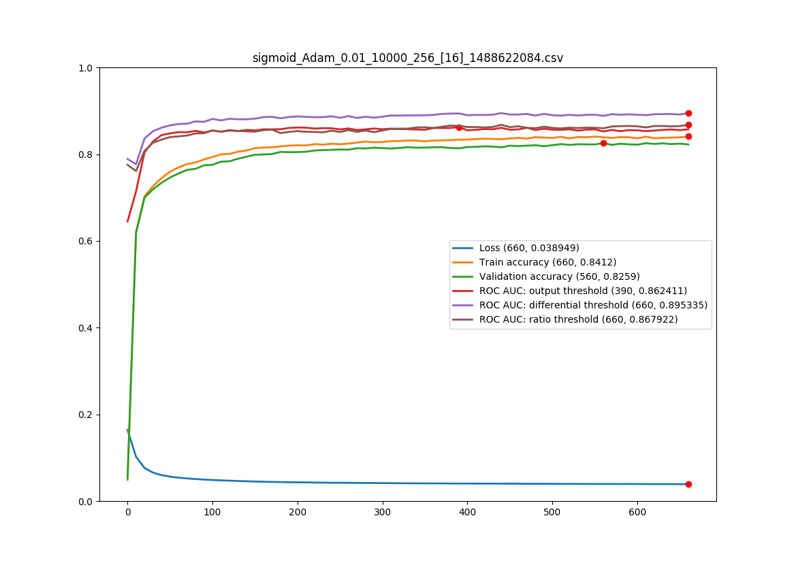

#Rejection Option

| Test | Steps | Loss | Trn acc | Vld acc | Area 0 | Area 1 | Area 2 | Time |
| ---- | ----- | ---- | ------- | ------- | ------ | ------ | ------ | ---- |
| sigmoid_Adam_0.01_10000_256_[12]_1488621432.csv |    830 | 0.047262 | 0.790900 | 0.780000 | 0.850924 | 0.882532 | 0.856385 |    1 |
| sigmoid_Adam_0.01_10000_256_[12]_1488621621.csv |    430 | 0.049244 | 0.785800 | 0.768500 | 0.845237 | 0.873289 | 0.846074 |    0 |
| sigmoid_Adam_0.01_10000_256_[16]_1488621717.csv |   1650 | 0.037549 | 0.840600 | 0.823600 | 0.871200 | 0.894764 | 0.864646 |    3 |
| sigmoid_Adam_0.01_10000_256_[16]_1488622084.csv |    660 | 0.038949 | 0.841200 | 0.822700 | 0.857736 | 0.895335 | 0.867922 |    1 |
| sigmoid_Adam_0.01_10000_256_[20]_1488622234.csv |    430 | 0.034434 | 0.863800 | 0.837200 | 0.871268 | 0.900856 | 0.866268 |    0 |
| sigmoid_Adam_0.01_10000_256_[20]_1488622334.csv |   1260 | 0.032140 | 0.873100 | 0.845200 | 0.868339 | 0.897856 | 0.868538 |    2 |
| sigmoid_Adam_0.01_10000_256_[24]_1488622623.csv |    930 | 0.027467 | 0.895500 | 0.864500 | 0.869831 | 0.904777 | 0.875993 |    1 |
| sigmoid_Adam_0.01_10000_256_[24]_1488622841.csv |    720 | 0.029144 | 0.884600 | 0.853000 | 0.872013 | 0.903494 | 0.879257 |    1 |
| sigmoid_Adam_0.01_10000_256_[28]_1488623013.csv |    560 | 0.024962 | 0.906900 | 0.869000 | 0.881805 | 0.907253 | 0.877589 |    1 |
| sigmoid_Adam_0.01_10000_256_[28]_1488623150.csv |    770 | 0.022516 | 0.918100 | 0.877600 | 0.878877 | 0.908414 | 0.882460 |    1 |
| sigmoid_Adam_0.01_10000_256_[32]_1488623339.csv |    620 | 0.021199 | 0.922600 | 0.879100 | 0.887576 | 0.910011 | 0.878773 |    1 |
| sigmoid_Adam_0.01_10000_256_[32]_1488623494.csv |   1070 | 0.020052 | 0.929300 | 0.888400 | 0.868302 | 0.905249 | 0.878331 |    2 |
| sigmoid_Adam_0.01_10000_256_[36]_1488623769.csv |    610 | 0.018834 | 0.935100 | 0.893000 | 0.877167 | 0.912743 | 0.888214 |    1 |
| sigmoid_Adam_0.01_10000_256_[36]_1488623922.csv |    640 | 0.017847 | 0.937600 | 0.893600 | 0.880011 | 0.906710 | 0.877907 |    1 |
| sigmoid_Adam_0.01_10000_256_[40]_1488624084.csv |    360 | 0.017121 | 0.942400 | 0.895100 | 0.881921 | 0.910981 | 0.883029 |    0 |
| sigmoid_Adam_0.01_10000_256_[40]_1488624180.csv |    580 | 0.015619 | 0.949700 | 0.899600 | 0.880462 | 0.913410 | 0.881351 |    1 |
| sigmoid_Adam_0.01_10000_256_[44]_1488624330.csv |    640 | 0.012930 | 0.963200 | 0.906300 | 0.876032 | 0.907625 | 0.878042 |    1 |
| sigmoid_Adam_0.01_10000_256_[44]_1488624500.csv |    590 | 0.013697 | 0.960400 | 0.905900 | 0.889454 | 0.915483 | 0.872719 |    1 |
| sigmoid_Adam_0.01_10000_256_[48]_1488624657.csv |    620 | 0.011262 | 0.967700 | 0.904600 | 0.877133 | 0.909393 | 0.878653 |    1 |
| sigmoid_Adam_0.01_10000_256_[48]_1488624825.csv |    510 | 0.011826 | 0.965200 | 0.903800 | 0.883456 | 0.918094 | 0.885964 |    1 |

